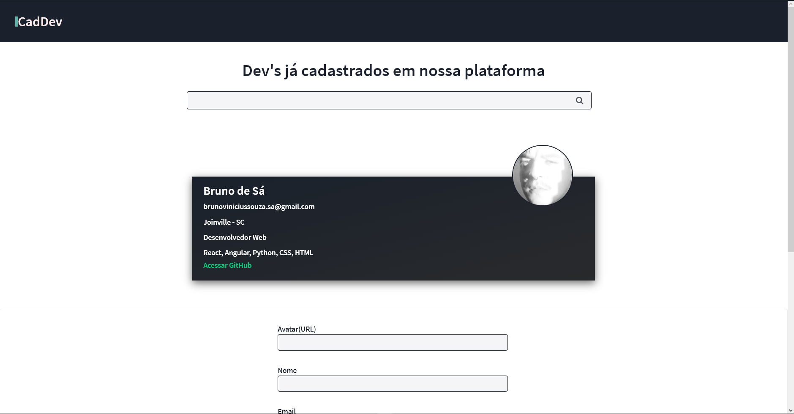

## CadDev

# Sobre

O desafio foi realizado pela DataSprints, com o intuíto de testar meus conhecimentos em frontend.

A tecnologia utilizada ([Angular](https://angular.io/)) foi escolhida pela empresa. 

Utilizado do conceito de mobile first, no qual consiste em desenvolver a aplicação voltada primeiramente para o mobile, e depois fazer adaptações para o desktop e outras plataformas.

*Na aplicação é possível*
- [x] Cadastrar um dev na plataforma
- [x] Buscar por um dev através do nome, tecnologias que utiliza, cidade e escolaridade.

## Como instalar e rodar a aplicação

### Requisitos

É necessário ter instalado [Git](https://git-scm.com), [Node.js](https://nodejs.org/en/) e o [NPM](https://www.npmjs.com/) ou [Yarn](https://yarnpkg.com/)

### Backend

*Utilizada uma API em NodeJS*

  1. Clone o repositório da API```$ git clone <https://github.com/brunovdsa/apiFake>```
  2. Entre na pasta do projeto e instale as dependências ```yarn install``` ou ```npm i```
  3. Rode ```npx json-server db.json``` para inicializar o servidor
  *servidor inciará na porta:3000*
  
### Frontend

  1. Clone esse repositório
  2. Acesse a pasta do projeto e instale as dependências ```npm i```
  3. Rode ```ng serve``` ou ```yarn start```


## Screenshots cadDev
<p aling="center">
    
</p>
<p aling="center">
    
</p>
<p aling="center">
    
    
</p>
